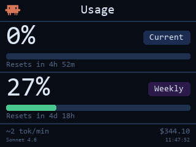
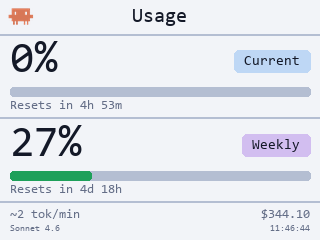

# Claude Meter

> Written in Python 3.

Claude Meter displays your Claude Code usage live on a small USB LCD screen. It tracks token limits, cost, and activity so you always know where you stand — without opening a browser.

| Dark mode | White mode |
|:---------:|:----------:|
|  |  |

---

## What it shows

| Area | Info |
|---|---|
| Section 1 | 5-hour token utilization % + progress bar + reset countdown |
| Section 2 | Weekly token utilization % + progress bar + reset countdown |
| Footer | Burn rate (tok/min) or activity spinner · session cost · model · clock |

---

## Requirements

### Hardware
- **AX206 USB LCD** (320×240, VID `0x1908` PID `0x0102`)
- Windows: install the **libusb-win32** driver via [Zadig](https://zadig.akeo.ie/)

### Software
- Python 3.10+
- Claude Code CLI (provides `~/.claude/` session data and OAuth token)

### Python packages

```
pip install pillow pyusb numpy
```

> `numpy` is optional but recommended — significantly speeds up frame rendering.

---

## Setup

```
git clone <repo>
cd claude-meter
pip install pillow pyusb numpy
```

**Windows only:** run as Administrator (required for raw USB access).

---

## Usage

```bash
# Live LCD mode
python run.py

# Preview mode — saves preview.png, no LCD needed
python run.py --preview

# Adjust backlight (0–7, default 5)
python run.py --brightness 3

# Flip controls (both flips are on by default)
python run.py --no-flip-h        # disable horizontal flip
python run.py --no-flip-v        # disable vertical flip
python run.py --no-flip-h --no-flip-v  # no flip at all

# Stats refresh interval (default 5s)
python run.py --stats-interval 10

# Calibrate token limit (run the moment Claude tells you you've hit the rate limit)
python run.py --calibrate

# Debug USB output
python run.py --debug
```

### Themes

```bash
# Dark mode (default)
python run.py

# Explicit dark mode
python run.py --dark

# Light / white mode
python run.py --white
```

`--dark` and `--white` are mutually exclusive. The flags work with `--preview` too, so you can check both themes without an LCD:

```bash
python run.py --preview --white
python run.py --preview --dark
```

### Auto-reconnect

If the LCD is unplugged while the meter is running, it will automatically attempt to reconnect every **5 seconds** once you plug it back in — no restart needed. You'll see:

```
[lcd] Display disconnected — reconnecting...
[lcd] Reconnected successfully.
```

---

## How usage is measured

Token utilization is fetched from `https://api.anthropic.com/api/oauth/usage` using the OAuth token stored in `~/.claude/.credentials.json` — the same source as the `/usage` command in Claude Code. This gives exact server-side percentages and reset times.

JSONL files in `~/.claude/projects/` are still scanned for:
- Activity detection (is Claude currently responding?)
- Session cost estimate
- Burn rate (tokens/min over the last 5 minutes)
- Fallback percentages if the API is unreachable

The API is polled every **2 minutes**. Between polls the display uses cached data.

---

## Calibration

If the API is unreachable and the fallback token count looks wrong, run:

```bash
python run.py --calibrate
```

Run this at the exact moment Claude tells you you've hit the rate limit. It saves your current 5-hour token count as the limit baseline and clears the usage cache.

---

## Project structure

```
claude_meter/
    __init__.py
    __main__.py   — main loop, CLI flags, background stats thread
    api.py        — OAuth fetch, cache management
    config.py     — display constants, colors, token limits
    lcd.py        — AX206 USB LCD driver (SCSI protocol)
    renderer.py   — PIL drawing, fonts, render()
    stats.py      — JSONL parser, parse_stats()
    claude_icon.png
run.py            — entry point
```

---

## Troubleshooting

**`AX206 LCD not found`** — Make sure libusb-win32 is installed via Zadig. Run as Administrator.

**Display shows wrong orientation** — Use `--no-flip-h` / `--no-flip-v` to adjust.

**Percentages stuck at 100%** — Run `python run.py --calibrate` then restart normally.

**`pip install pyusb` but still no USB** — On Windows, Zadig must replace the device driver with libusb-win32, not WinUSB.

**Display goes blank / stops updating after unplug** — This is expected; the meter will reconnect automatically when you plug it back in. If it doesn't recover, check that the USB cable is fully seated and the Zadig driver is still assigned to the device.
